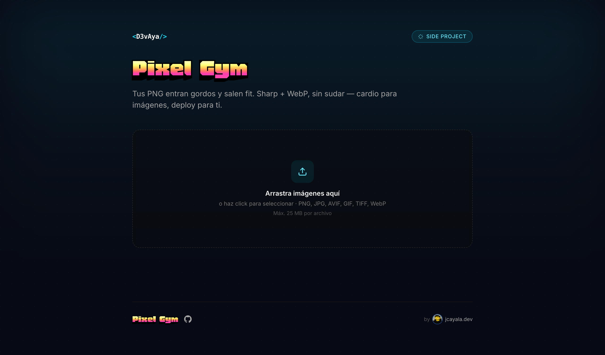

# Pixel Gym

> Tus PNG entran gordos y salen fit. Sharp + WebP, sin sudar — cardio para imágenes, deploy para ti.



App liviana para que un equipo (o tú mismo) suba imágenes desde el navegador, las procese con **Sharp** en el servidor y descargue WebP optimizado: una a una o todo en un ZIP.

Construido con Next.js 16 (App Router) + React 19 + Sharp 0.33 + Tailwind 3 + TypeScript. Pensado para correr en Vercel (Fluid Compute) sin configuración adicional, o local con `npm run dev`.

---

## Features

- **Drag & drop** + selector de archivos múltiples.
- **Procesamiento en paralelo** con cola de concurrencia configurable.
- **Per-file feedback**: estado por archivo (queued → uploading con %, processing, done, error) y barra de progreso global.
- **Descarga individual** (.webp) o **batch como .zip** (JSZip via dynamic import — no aumenta el bundle inicial).
- **Sharp WebP** con `quality` y `effort` máximos por defecto. Reorientación EXIF (`rotate()`) y `smartSubsample`.
- **Single endpoint** (`POST /api/process`) con error envelope consistente y status codes semánticos.
- **Branding centralizado**: un único archivo (`branding.config.ts`) controla copy, logo, paleta, fuentes, límites y MIME aceptados.
- **Seguridad**: CSP, HSTS, X-Frame-Options, X-Content-Type-Options, Referrer-Policy, Permissions-Policy. Validación de tipo MIME + magic bytes en servidor. Bloqueo de zip-slip y decompression bombs.
- **Accesibilidad**: focus rings, ARIA labels, `prefers-reduced-motion`, keyboard navigation.

---

## Arranque rápido

```bash
git clone https://github.com/D3vaya/pixel-gym.git
cd pixel-gym
npm install
npm run dev
# → http://localhost:3000
```

Deploy a Vercel:

```bash
npm i -g vercel        # si no lo tienes
vercel deploy          # preview URL
vercel deploy --prod   # producción
```

No requiere variables de entorno ni servicios externos. El procesamiento corre dentro del Vercel Function (o tu Node local) y el ZIP se genera en el cliente.

---

## Customizar para tu equipo o marca

**Toda la personalización vive en un solo archivo: [`branding.config.ts`](./branding.config.ts).**

Después de cualquier cambio, reinicia `npm run dev`.

### 1. Nombre, copy y enlaces

```ts
brand: {
  name: "<D3vAya/>",                 // wordmark del header (si lleva <…/> se estiliza como código)
  product: "Pixel Gym",              // título grande
  productHref: "https://github.com/...",  // opcional: el título lleva al repo
  tagline: "...",                    // descripción debajo del título
  badge: "side project",             // chip en la esquina superior derecha
  footer: {
    left: "Sharp · WebP · q75 · effort max",
    right: "jcayala.dev",            // texto a la derecha del footer
    rightHref: "https://www.jcayala.dev/",  // opcional: lo hace clickable
    signaturePrefix: "by",           // opcional: prefijo tipo firma ("by", "—", "made by")
  },
  locale: "es",                      // <html lang="...">
}
```

Si dejas `productHref` o `rightHref` como `undefined`, simplemente no se renderiza el link.

### 2. Logo / firma

Pon tu imagen en `public/` y referénciala:

```ts
logo: {
  src: "/sign.png",
  alt: "D3v",
  width: 48, height: 48,             // dimensiones intrínsecas
  header: {
    show: false,                     // true para wordmarks (WOM-style)
    className: "h-7 w-auto",
  },
  footer: {
    show: true,                      // true para firmas tipo avatar
    className: "h-5 w-5 shrink-0 rounded-full object-cover ring-1 ring-brand-500/30",
  },
}
```

- **Wordmark horizontal** (estilo logo corporativo): `header.show: true`, `footer.show: false`, className `h-7 w-auto`.
- **Avatar redondo personal** (estilo firma): `header.show: false`, `footer.show: true`, className `h-5 w-5 rounded-full`.

### 3. Paleta

Pasa la escala completa 50→950 en hex. La forma más fácil es ir a [uicolors.app/create](https://uicolors.app/create), elegir tu color base y copiar los 11 valores.

```ts
palette: {
  50: "#ecfeff", 100: "#cffafe", 200: "#a5f3fc", 300: "#67e8f9",
  400: "#22d3ee", 500: "#06b6d4", 600: "#0891b2", 700: "#0e7490",
  800: "#155e75", 900: "#164e63", 950: "#083344",
}
surface: {
  background: "#070a14",   // fondo de página
  foreground: "#e8f4ff",   // color de texto principal
}
```

Los colores se exponen como CSS variables (`--brand-50` … `--brand-950`) y Tailwind las consume como `bg-brand-500`, `text-brand-300`, `border-brand-500/20`, etc., **con soporte de opacidad incluido**.

### 4. Tipografía

Las fuentes se cargan vía [`next/font/google`](https://nextjs.org/docs/app/api-reference/components/font) en `app/layout.tsx`. Por defecto:

- `Inter` para todo el body (sans-serif neutra).
- `Honk` para el título del producto (variable font expresiva tipo arcade).

Para cambiar la fuente del título:

1. Edita la importación en `app/layout.tsx`:
   ```ts
   import { Inter, NombreFuente } from "next/font/google";
   ```
2. Crea el loader:
   ```ts
   const display = NombreFuente({
     subsets: ["latin"],
     variable: "--font-display",
     display: "swap",
   });
   ```
3. Añade la variable al `<html className=...>`.
4. Actualiza `tailwind.config.ts` → `fontFamily.display`.

### 5. Procesamiento

```ts
processing: {
  quality: 75,             // WebP quality 1–100
  effort: 6,               // 0–6 (más alto = más lento + más pequeño)
  maxFileBytes: 25 * 1024 * 1024,
  maxFiles: 100,           // cap por sesión en el cliente
  maxConcurrent: 4,        // uploads simultáneos
  maxDimension: 12000,     // rechaza imágenes más grandes (HTTP 422)
  allowedMime: ["image/png", "image/jpeg", ...],  // MIME types aceptados
}
```

Los mismos valores se importan tanto en el cliente (`components/Uploader.tsx`) como en el servidor (`app/api/process/route.ts`).

---

## Cómo está cableado

```
[Browser]
   │  POST /api/process  (FormData: file)  — uno por imagen, en paralelo
   ▼
sharp(buf, { failOn, limitInputPixels })
  .rotate()
  .webp({ quality, effort, smartSubsample })
   │
   ▼
WebP binary
+ headers: X-Original-Bytes, X-Webp-Bytes, X-Content-Type-Options: nosniff
   │
   ▼
Cliente: muestra progreso real (xhr.upload.progress) y acumula blobs
   │
   ▼
"Descargar .zip" → dynamic import('jszip') → bundle → download
```

Decisiones clave:

- **Single-file endpoint** (no batch) → progreso real por archivo y errores aislados.
- **JSZip dynamic import** → bundle inicial pequeño; solo se carga al pulsar descargar.
- **CSS variables para colores** → cambiar paleta no requiere recompilar Tailwind ni reiniciar nada.
- **`as const` en el config** → branding 100% type-safe sin runtime overhead.

---

## API

### `POST /api/process`

Sube **una** imagen, recibe el WebP optimizado.

**Request**

```
Content-Type: multipart/form-data

file: <File>
```

**Responses**

| Status | Cuerpo |
|---|---|
| `200` | `image/webp` binary. Headers: `X-Original-Bytes`, `X-Webp-Bytes`. |
| `400` | `{ error: { code: "INVALID_FORM" \| "NO_FILE", message } }` |
| `405` | `{ error: { code: "INVALID_FORM", message: "Method not allowed. Use POST." } }` |
| `413` | `{ error: { code: "FILE_TOO_LARGE", message, details: { size, max } } }` |
| `415` | `{ error: { code: "UNSUPPORTED_TYPE", message, details: { allowed } } }` |
| `422` | `{ error: { code: "DECODE_FAILED" \| "IMAGE_TOO_LARGE", message, details? } }` |
| `500` | `{ error: { code: "INTERNAL", message } }` |

Error envelope estable — clients pueden hacer match por `code`.

---

## Estructura del proyecto

```
poc/
├── app/
│   ├── api/process/route.ts   ← endpoint Sharp
│   ├── layout.tsx              ← fuentes + CSS vars de branding
│   ├── page.tsx                ← UI principal
│   └── globals.css
├── components/
│   ├── Uploader.tsx            ← client component (estado por archivo, XHR)
│   └── icons.tsx               ← SVG icons inline
├── public/
│   ├── sign.png                ← firma / avatar
│   └── image.png               ← logo alternativo
├── branding.config.ts          ← 🎯 punto único de personalización
├── next.config.ts              ← security headers + CSP
├── tailwind.config.ts          ← brand colors via CSS vars
└── tsconfig.json
```

---

## Seguridad

- **Security headers globales** (`next.config.ts`): X-Frame-Options, X-Content-Type-Options, Referrer-Policy, Permissions-Policy, Content-Security-Policy. HSTS solo en producción.
- **CSP**: en dev permite `'unsafe-eval'` y `ws:` (React + HMR de Turbopack lo requieren); en producción es estricto.
- **MIME allowlist** + magic-byte validation (Sharp `failOn: "error"`).
- **Decompression bomb protection**: `limitInputPixels` + `maxDimension`.
- **Zip-slip prevention**: nombres de archivo sanitizados (strip path separators) en cliente.
- **No data egress**: el archivo se procesa en memoria del Function y se devuelve en la misma respuesta — no se persiste nada.

---

## Stack

| Pieza | Versión |
|---|---|
| Next.js | 16 (App Router, Turbopack) |
| React | 19 |
| Sharp | 0.33 |
| JSZip | 3.10 (dynamic import) |
| Tailwind CSS | 3.4 |
| TypeScript | 5.7 |
| Runtime | Node.js 24 LTS |

---

## License

MIT — usa, modifica y rebrandea para tu equipo. Si haces algo cool, [escríbeme](https://www.jcayala.dev/).
